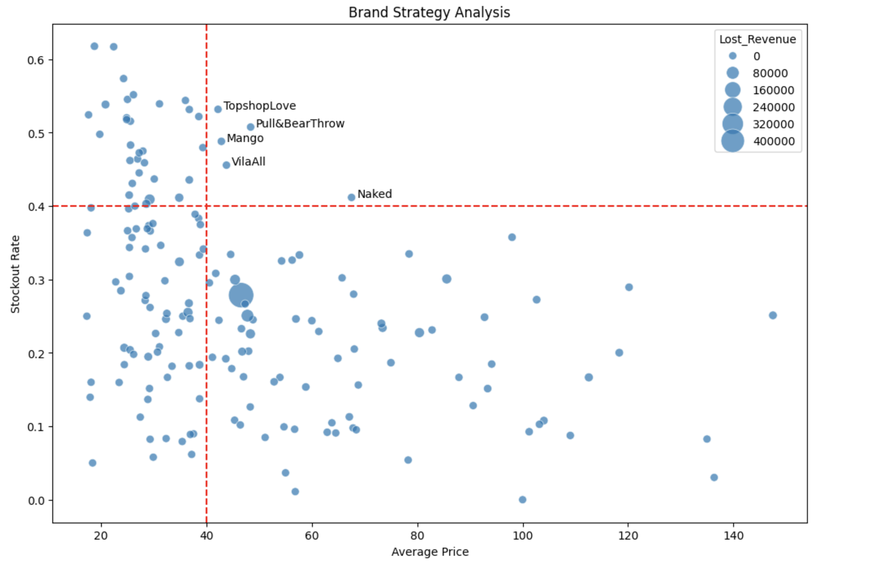

# Fashion E-Commerce Stockout & Pricing Analysis (ASOS)

An exploratory data analytics pipeline evaluating size-level stockout rates and quantifying lost revenue potential across fashion brands on the ASOS platform.

---

## 1. Business Context
In apparel retail, broken size curves (where common middle sizes sell out while extreme sizes remain) generate **phantom inventory**: items appear available in catalog views, but customer conversion plummets at the product page[cite: 1].

This project investigates ~18,000 product records on ASOS to compute size-level stockouts, identify partner brand fulfillment bottlenecks, and isolate lost top-line revenue[cite: 1].

---

## 2. Technical Workflow

- **Dataset:** ASOS Product Catalog dataset (~18,300 product listings)[cite: 1].
- **Data Preprocessing:**
  - Coerced invalid price entries and filtered unpriced items[cite: 1].
  - Parsed text product descriptions to extract structured brand identifiers[cite: 1].
  - Mapped key brands (e.g., *Topshop, New Look, River Island, Miss Selfridge*) and filtered tail brands with under 10 listings[cite: 1].
- **Size Stockout Parsing:**
  - Split comma-delimited size availability strings to isolate individual size options[cite: 1].
  - Extracted stockout counts and computed bounded stockout ratios ($0.0 \text{ to } 1.0$) per product[cite: 1].
- **Phantom Revenue Estimation:**
  $$\text{Lost Revenue} = \text{Unit Price} \times \text{Out-of-Stock Size Count}$$[cite: 1]

---

## 3. Brand Strategy Matrix & Findings

### Strategic Positioning Quadrants
Brands are mapped across Average Unit Price and Average Size Stockout Rate, with bubble size proportional to estimated lost revenue[cite: 1]:



- **High Price / High Stockout (Top Right):** Premium labels with high unfulfilled demand (e.g., leather jackets, seasonal coats) suffering significant revenue leakage[cite: 1].
- **Low Price / High Stockout:** High-turnover fast-fashion items requiring tighter reorder batches[cite: 1].
- **High Price / Low Stockout:** Well-managed premium categories with stable inventory availability[cite: 1].
- **Low Price / Low Stockout:** Basic items with excess inventory, prime candidates for clearance markdowns[cite: 1].

---

## 4. Business Impact & Key Takeaways

1. **Outerwear & Premium Leakage:** Outerwear and premium apparel lines exhibited stockout rates exceeding 40%, accounting for the largest share of estimated uncaptured GMV[cite: 1].
2. **Third-Party Partner Gaps:** Direct-to-consumer partner brands suffered noticeably higher stockout rates than ASOS private labels, highlighting fulfillment latency on third-party supply chains[cite: 1].

---

## 5. Strategic Recommendations

1. **Targeted Replenishment Depth:** Increase purchase order volumes for core sizes (UK 8–12) within top-right quadrant brands before peak demand periods[cite: 1].
2. **Vendor EDI/VMI Feeds:** Establish integrated vendor-managed inventory connections with third-party brands to automate restocking when size curves break[cite: 1].
3. **Deadstock Clearance Scheduling:** Trigger automatic markdown workflows for bottom-left quadrant items that maintain low stockout rates past 60 days of catalog life[cite: 1].

---

## 6. Quickstart

Run directly in Google Colab:

[](https://colab.research.google.com/github/MRigoni10/fashion-ecommerce-stockout-analysis/blob/main/products_asos_analysis.ipynb)

To run locally:

```bash
git clone [https://github.com/MRigoni10/fashion-ecommerce-stockout-analysis.git](https://github.com/MRigoni10/fashion-ecommerce-stockout-analysis.git)
cd fashion-ecommerce-stockout-analysis
pip install -r requirements.txt
jupyter notebook
